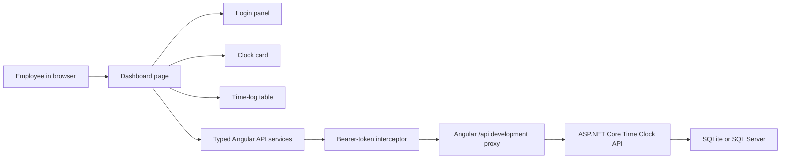

# Time Clock Dashboard UI

> **Status:** Proposed for review

## 1. Executive summary

The API supports authentication, clock actions, status, and time-log history, but employees currently need Swagger or another API client to use it. This change will replace the Angular starter screen with one responsive dashboard where an employee can sign in, see the server-confirmed clock state, perform the valid clock action, and review work sessions and breaks. The UI will use small standalone Angular components, signals for page state, and typed HTTP services so each Angular concept can be learned separately. The main downside is that a same-page login and browser-stored bearer token are suitable for this internal first version, but a production deployment should eventually move authentication to a more secure cookie-based design.

## 2. Context and scope

`TimeOffFrontend` is an Angular 22.1 standalone application that still contains the generated welcome screen. It includes Tailwind CSS 4, Angular Router, server rendering, and Vitest, but it has no routes, HTTP setup, application models, or API integration.

This design covers one employee-facing route. Before authentication, that route shows a login panel. After authentication, it shows a clock card and a paginated time-log table. The page calls the existing protected API and treats every API response as authoritative.

The chatbot is deliberately excluded. The API services created here can be reused by a future chatbot, but no chat UI, AI provider, prompt, tool execution, or chatbot action confirmation is part of this design.

## 3. System context

The browser establishes identity by calling the API login endpoint. A functional HTTP interceptor adds the returned bearer token only to relative `/api` requests. The dashboard page coordinates API calls and passes state to display components.



The frontend must preserve these backend boundaries:

1. The JWT, not a request-body user ID, identifies the employee.
2. The API calculates durations and decides whether an action is valid.
3. Work sessions remain the top-level time-log records, with breaks nested under their parent session.
4. All action timestamps are ISO 8601 values with an offset. The browser will send `new Date().toISOString()`, which uses `Z` for UTC.

## 4. Proposed design

### How it works

An employee opens `http://localhost:4200`. If no valid session is available, the route shows email and password fields. A successful `POST /api/auth/login` response is held by `AuthService`, and the JWT is stored in `sessionStorage` for the current browser tab.

The dashboard then loads `GET /api/time-clock/status` and the first page of `GET /api/time-logs` in parallel. `DashboardPageComponent` keeps independent loading and error state for the clock card and table, so one section can remain usable if the other request fails.

The clock card renders one of three server states:

1. `ClockedOut` shows **Clock In**.
2. `Working` shows **Take Break** and **Clock Out**.
3. `OnBreak` shows **End Break**. Clock out is not offered because the API forbids it while a break is active.

Clicking an action disables all clock-action buttons, creates the timestamp at click time, and sends the matching POST request. The UI does not optimistically change status. After success or a `409 Conflict`, it reloads status and logs so the screen matches the database. Mutation requests are never automatically retried.

The table shows one parent row per work session. Its columns are Day and Date, Type, Clock In, Clock Out, Duration, Break Time, and Status. Type is `Work`. A row with breaks can expand to show indented child rows whose Type is `Break` and whose duration comes from the API. Pagination counts work sessions, not expanded break rows.

### Components and responsibilities

The proposed source layout is:

```text
TimeOffFrontend/
├── proxy.conf.json
└── src/app/
    ├── app.config.ts
    ├── app.routes.ts
    ├── app.ts
    ├── app.html
    ├── core/
    │   ├── api/
    │   │   ├── api-error.model.ts
    │   │   ├── time-clock-api.service.ts
    │   │   └── time-logs-api.service.ts
    │   └── auth/
    │       ├── auth.interceptor.ts
    │       ├── auth.model.ts
    │       └── auth.service.ts
    ├── features/
    │   ├── dashboard/
    │   │   ├── dashboard-page.component.ts
    │   │   ├── dashboard-page.component.html
    │   │   ├── dashboard-page.component.css
    │   │   └── dashboard-page.component.spec.ts
    │   ├── login/
    │   │   └── login-panel.component.*
    │   ├── time-clock/
    │   │   └── clock-card.component.*
    │   └── time-logs/
    │       └── time-log-table.component.*
    └── shared/
        ├── models/
        │   ├── clock.model.ts
        │   └── time-log.model.ts
        └── pipes/
            └── duration.pipe.ts
```

`App` owns only the application shell and `RouterOutlet`. It does not fetch data or own employee state.

`DashboardPageComponent` is the page-level coordinator. It owns authentication-aware loading, the status and time-log signals, paging, action submission, refresh behavior, and section-level errors. It does not construct authorization headers or calculate worked duration.

`LoginPanelComponent` owns the reactive login form, client-side required-field validation, and submit event. It does not store the JWT or call clock endpoints.

`ClockCardComponent` receives status, loading state, and pending action through inputs. It emits a typed action such as `clockIn`, `startBreak`, `endBreak`, or `clockOut`. It does not call the API or invent the next status.

`TimeLogTableComponent` receives a paged response and emits page and refresh events. It owns expansion state for nested break rows and presentation formatting. It does not fetch records or recalculate durations.

`AuthService` owns the current authentication response, session persistence, login, and logout. It exposes read-only authentication state. It does not decide which clock button is valid.

The API services own typed endpoint calls and nothing else. The [functional interceptor](https://angular.dev/guide/http/interceptors) adds the bearer token to relative `/api` requests and handles `401` by clearing the session. It must not attach the token to external URLs.

Tests stay beside the component or service they cover. Shared models contain only TypeScript interfaces and status unions, not UI state.

### Decisions

**Use standalone components and signals, not NgModules or NgRx.** The generated app already uses standalone bootstrapping, and Angular recommends [standalone components](https://angular.dev/guide/ngmodules/overview) for new code. [Signals](https://angular.dev/guide/signals) are enough for one page and make state changes visible while learning. NgRx would add actions, reducers, and effects before the application needs shared complex state.

**Use a route even though there is one page.** The empty path will render `DashboardPageComponent`, while `App` remains a small shell. This teaches the router now and avoids turning the root component into a feature component. The primary route can load eagerly because it is the only page.

**Use client-side rendering, not the generated prerender setup.** Angular describes [client-side rendering](https://angular.dev/guide/routing/rendering-strategies) as a good fit for interactive internal dashboards where search-engine visibility is irrelevant. It also lets authentication and `sessionStorage` code assume a browser environment. The cost is losing server-rendered initial HTML, which this private page does not need.

**Use a same-page login gate.** The API requires a JWT, so a working UI cannot omit authentication. Showing the login panel in the dashboard route preserves the one-page requirement and avoids route guards during the first learning phase. A separate login route can be introduced later if the application grows.

**Use `sessionStorage` for the first version.** It survives a refresh in the same tab and clears when the tab closes. It is still readable by JavaScript, so the design avoids rendering untrusted HTML and treats a future secure, HTTP-only cookie flow as production hardening.

**Use a development proxy and relative API URLs.** `proxy.conf.json` will forward `/api` to `https://localhost:7251` with local-certificate verification disabled. This avoids adding development-only CORS rules to the API. Production must place both applications behind one origin or provide a documented runtime API base URL.

**Use Tailwind and native HTML controls, not a component library.** Tailwind is already installed. Native buttons, forms, and tables keep the learning focus on Angular and avoid taking a dependency on Angular Material before reusable design patterns are needed.

**Keep page orchestration in the dashboard.** Child components use typed inputs and outputs, while the page invokes services. This makes data flow visible and gives the future chatbot a service layer it can reuse without coupling AI logic to button components.

## 5. Invariants and requirements

### Invariants

1. The UI never sends a user ID or employee ID in a clock-action request.
2. Exactly one clock mutation may be in flight from the page at a time.
3. The displayed clock state comes from `GET /api/time-clock/status`, not from button assumptions.
4. `Clock Out` is never offered while the status is `OnBreak`.
5. Durations displayed in the table come from API minute fields and are not recomputed from browser timestamps.
6. The bearer token is attached only to this application's relative `/api` requests.
7. A break remains visually associated with its parent work session.
8. A failed request does not erase the last successfully loaded status or table data.

### Requirements

- The page must work at desktop and narrow mobile widths. The table may scroll horizontally on small screens while retaining table semantics.
- The clock card must show the current status, today's worked and break time as live `HH:MM:SS` values, and only valid actions.
- The page must show loading, empty, success, and error states without relying only on color.
- Action buttons must be disabled while a mutation is pending.
- The table must load 20 work sessions per page and expose Previous and Next controls based on `totalPages`.
- Day and date come from `shiftDate`. Clock times use the session's stored timezone.
- Minute values use a shared formatter such as `630` to `10h 30m` and `0` to `0m`.
- The visible duration advances locally once per second according to the current status. A status refresh runs once every 60 seconds while authenticated and resynchronizes the exact totals with the server. The table refreshes after local actions or manual refresh, not on the timer.
- The layout must reserve no empty chatbot space. A future sidebar can be added beside the main dashboard without changing the API services.

## 6. Interfaces and data

The frontend mirrors the existing JSON contracts with TypeScript interfaces. Property names use the API's camel-case JSON names.

```ts
type ClockStatus = 'ClockedOut' | 'Working' | 'OnBreak';
type ClockAction = 'clockIn' | 'startBreak' | 'endBreak' | 'clockOut';

interface LoginRequest {
  email: string;
  password: string;
}

interface AuthResponse {
  accessToken: string;
  expiresAt: string;
  userId: number;
  employeeId: number;
  employeeNumber: string;
  email: string;
  firstName: string;
  lastName: string;
  role: 'Employee' | 'Administrator';
}

interface ClockActionRequest {
  dateTime: string;
}

interface ClockStatusResponse {
  status: ClockStatus;
  activeWorkLogId?: number;
  activeBreakLogId?: number;
  clockedInAt?: string;
  breakStartedAt?: string;
  asOf: string;
  currentDayEndsAt: string;
  workedMinutesToday: number;
  breakMinutesToday: number;
  workedSecondsToday: number;
  breakSecondsToday: number;
}

interface BreakResponse {
  id: number;
  start: string;
  end?: string;
  durationMinutes: number;
}

interface WorkSessionResponse {
  id: number;
  userId: number;
  employeeId: number;
  shiftDate: string;
  start: string;
  end?: string;
  status: 'Active' | 'Completed';
  timezone: string;
  totalElapsedMinutes: number;
  totalBreakMinutes: number;
  totalWorkedMinutes: number;
  breaks: BreakResponse[];
}

interface PagedResponse<T> {
  items: T[];
  page: number;
  pageSize: number;
  totalCount: number;
  totalPages: number;
}

interface ApiError {
  statusCode: number;
  code: string;
  message: string;
  traceId: string;
}
```

The first implementation uses these endpoints:

| Purpose | Method and path |
| --- | --- |
| Sign in | `POST /api/auth/login` |
| Read clock state | `GET /api/time-clock/status` |
| Clock in | `POST /api/time-clock/clock-in` |
| Start break | `POST /api/time-clock/break/start` |
| End break | `POST /api/time-clock/break/end` |
| Clock out | `POST /api/time-clock/clock-out` |
| Read sessions | `GET /api/time-logs?page={page}&pageSize=20` |

### Naming and identity

The JWT returned by login is the only source of employee identity for API calls. The frontend displays the name and employee number from the authentication response but never uses them to authorize or filter clock actions. Work-session and break IDs come from the API and are used only as stable row keys and expansion keys. If a stored session cannot be restored or the token has expired, the frontend clears it and returns to the login panel.

## 7. Failure behavior and lifecycle

At startup, the application restores the authentication response from `sessionStorage`. A missing, malformed, or expired session is discarded before protected calls begin. An API outage shows a retryable section error and leaves the Angular application running.

`400` and `409` mutation errors show the API message near the clock card. The page then refreshes status because the database may have changed in another tab or request. `401` clears authentication and returns to login. `403` shows the API message without pretending the action succeeded. Unexpected errors show a generic message plus the server trace ID when available.

GET requests may be retried only by the user, the 60-second status refresh, or a later normal refresh. POST mutations are not automatically retried because the first request may have reached the API even if the response was lost.

When the component is destroyed or the employee logs out, the status timer and active subscriptions stop. A request already accepted by the backend is allowed to finish server-side, but its late response must not update a destroyed page. Logging out clears browser authentication state immediately.

The API calculates exact worked and break seconds from persisted work and break timestamps whenever status is requested. It also returns `asOf` and `currentDayEndsAt`, both in UTC, so the browser knows how long remains in the employee's current local day without trusting the device's timezone. The browser treats those values as an authoritative baseline: worked seconds advance only in `Working`, break seconds advance only in `OnBreak`, and both remain fixed in `ClockedOut`. Each one-second display update derives elapsed time from the baseline timestamp instead of counting callbacks, so a throttled background tab catches up when it runs again. At the local-day boundary the display resets immediately and requests a fresh status baseline. Reloading or closing the page does not stop the server-side session; after the next authenticated status request, the display resumes from the persisted total.

If status succeeds and logs fail, the clock card remains usable and the table shows its own retry state. If a mutation succeeds but either refresh fails, the page reports that the action was accepted and offers refresh rather than guessing the new state.

## 8. Security, privacy, and operations

The backend remains the authorization boundary. The frontend hides invalid controls for usability but does not replace API authorization or validation.

The login password exists only in the form until submission. It is not written to storage, application logs, URLs, or error messages. The JWT is stored per tab in `sessionStorage`, never printed, and attached only to relative `/api` requests. No UI code uses raw HTML injection for API messages.

The display ticker performs no network requests. The status refresh creates at most one GET request per authenticated tab per minute, pauses when the page is destroyed, and does not poll time logs. Mutation controls allow one pending action, which prevents accidental double clicks but does not replace backend concurrency protection.

Local development requires the Angular server on port `4200` and the API HTTPS profile on port `7251`. Production deployment configuration is unchanged by this first design and must provide the same-origin `/api` path before release.

## 9. Acceptance criteria

- An employee can log in with a valid seeded account and see the dashboard without leaving the route.
- Invalid credentials display the API error and do not create an authenticated session.
- `ClockedOut` shows only Clock In, `Working` shows Take Break and Clock Out, and `OnBreak` shows only End Break.
- Each action sends the current ISO 8601 UTC timestamp, disables duplicate actions, and refreshes status and logs after completion.
- Clock out is not available during an active break.
- The clock card displays today's worked and break durations in hours and minutes.
- The table displays work sessions with day/date, type, times, worked duration, break duration, and status.
- Expanding a session displays its nested breaks without changing work-session pagination.
- Empty history, API failure, loading, and retry states are understandable and keyboard accessible.
- A `401` response clears the stored session and returns the employee to the login panel.
- The frontend runs through the `/api` development proxy without backend CORS changes.
- Refreshing the browser in the same tab restores an unexpired login; closing the tab removes it.
- While working, worked time advances every second in `HH:MM:SS` and break time remains still. While on break, break time advances and worked time remains still. Both remain still after clock-out.
- Reloading or leaving and later reopening the application does not reset an active session; the next authenticated status request restores the server-computed elapsed seconds.
- No chatbot UI, AI call, or AI-triggered action is present.

## 10. Test approach

Vitest component tests will verify the three-state button matrix, disabled pending state, login validation, empty/error/table rendering, nested break expansion, paging events, `HH:MM:SS` formatting, and which timer advances in every clock state.

HTTP service tests will use Angular's HTTP testing utilities to verify method, URL, query parameters, and action request bodies. Interceptor tests will prove that the JWT is added to relative `/api` requests, omitted from external requests, and cleared on `401`.

Backend service tests will prove that status reports exact worked and break seconds from persisted timestamps, including an active break. Dashboard tests will use mocked services to prove initial parallel loading, independent section failures, post-action refresh, conflict refresh, and cleanup of the 60-second status refresh.

A manual browser check will run Angular at `http://localhost:4200` with the API HTTPS profile. It will cover login, the full clock-in, break, end-break, and clock-out sequence, table refresh, page reload, keyboard navigation, and a narrow viewport.

## 11. Risks and tradeoffs

- **Browser token theft:** Any script running in the page can read `sessionStorage`. Mitigate with no raw HTML injection, limited dependencies, and a future HTTP-only cookie design before handling production-sensitive accounts.
- **Backend and TypeScript contracts can drift:** Handwritten interfaces do not update automatically. Keep endpoint models centralized and later consider generating a client from OpenAPI.
- **Timezone formatting can be inconsistent across browsers:** Use `shiftDate` for the calendar date and one shared formatter for timestamps with the API-provided timezone. Test with `Asia/Manila` and UTC.
- **Polling scales per open tab:** The fixed limit is one status request per minute per authenticated tab. Stop polling on logout and component destruction.
- **Client clocks and throttling can affect animation:** Derive each display update from a received baseline rather than counting interval callbacks, and replace the baseline with server-computed exact seconds every minute and after every clock action.
- **Some timezones skip or repeat local midnight:** Resolve invalid midnight to the first valid local instant and ambiguous midnight to its earliest UTC occurrence before clipping daily intervals.
- **Expanded break rows increase table complexity:** Keep breaks nested under one work session and exclude them from pagination totals.
- **Client-side rendering gives up server-rendered HTML:** This is acceptable for an authenticated internal tool and reduces browser-state complexity.

## 12. Open questions

- The visual brand, logo, and exact color palette are not specified. This does not block development; begin with a neutral accessible internal-dashboard style using the existing Tailwind setup.
- Production hosting and the final `/api` reverse proxy are not specified. This does not block local development, but it blocks production deployment.

## 13. Out of scope

- Chatbot UI, conversation storage, AI model integration, tool calling, and AI-triggered clock actions.
- Weekly or monthly summary cards and chatbot answers. The existing summary endpoint can support those later.
- Administrator screens, employee management, and time-off request approval UI.
- Registration, password reset, refresh tokens, single sign-on, and production cookie authentication.
- Editing, deleting, or correcting time logs.
- Notifications, offline actions, background synchronization, and multi-language support.
- Database schema and authentication changes.
